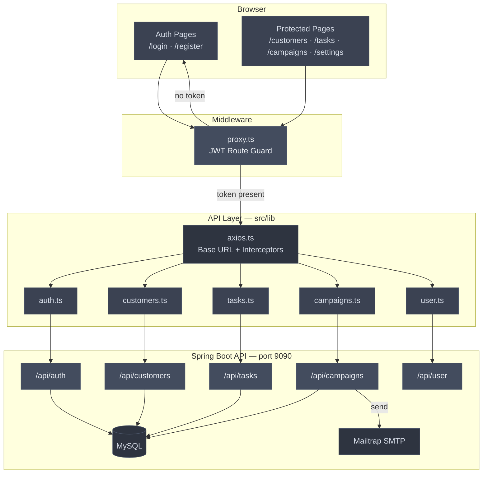
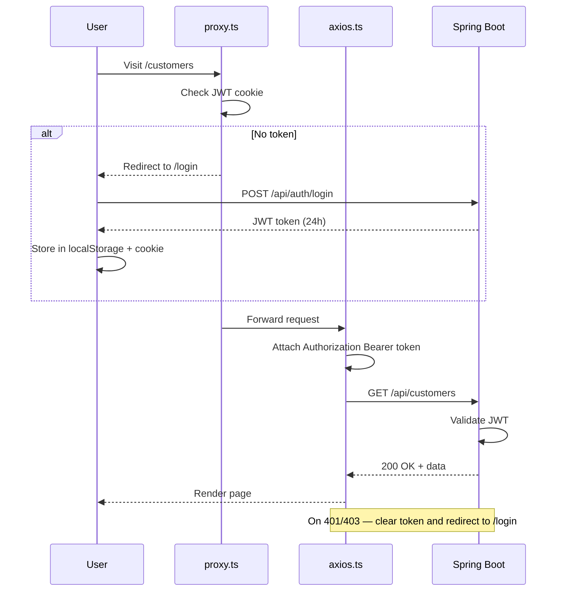
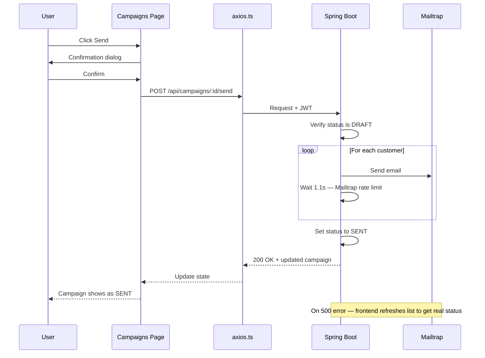
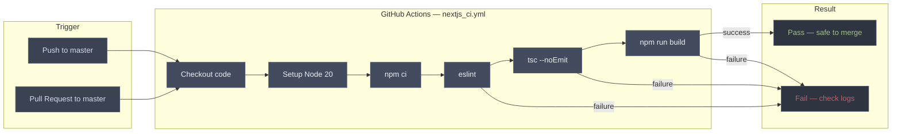

# CRM Frontend

> Next.js 16 · React 19 · TypeScript · Tailwind CSS

A modern CRM web application that communicates with a Spring Boot REST API secured with JWT authentication.

---

## Tech Stack

| Technology | Version | Purpose |
|-----------|---------|---------|
| Next.js | 16.2.4 | Framework (App Router) |
| React | 19 | UI library |
| TypeScript | 5 | Type safety |
| Tailwind CSS | 4 | Styling |
| Axios | 1.16 | HTTP client |
| Lucide React | 1.14 | Icons |

---

## System Architecture



---

## Authentication Flow



---

## Campaign Send Flow



---

## CI/CD Pipeline



---

## Project Structure

```
crm-front/
├── src/
│   ├── app/
│   │   ├── (auth)/                   # Public pages — no sidebar
│   │   │   ├── login/page.tsx
│   │   │   ├── register/page.tsx
│   │   │   └── layout.tsx
│   │   ├── (protected)/              # Private pages — JWT required
│   │   │   ├── dashboard/page.tsx
│   │   │   ├── customers/page.tsx
│   │   │   ├── tasks/page.tsx
│   │   │   ├── campaigns/page.tsx
│   │   │   ├── settings/page.tsx
│   │   │   └── layout.tsx
│   │   ├── globals.css
│   │   ├── layout.tsx
│   │   └── page.tsx                  # Redirects to /login
│   ├── components/
│   │   ├── Sidebar.tsx
│   │   ├── Alert.tsx
│   │   ├── TaskModal.tsx
│   │   ├── CustomerModal.tsx
│   │   └── CampaignModal.tsx
│   ├── lib/
│   │   ├── axios.ts                  # Axios instance + interceptors
│   │   ├── types.ts                  # All TypeScript interfaces
│   │   ├── auth.ts
│   │   ├── user.ts
│   │   ├── tasks.ts
│   │   ├── customers.ts
│   │   └── campaigns.ts
│   └── proxy.ts                      # Route protection
├── .env.local
├── .github/workflows/nextjs_ci.yml
├── package.json
└── tsconfig.json
```

---

## Pages Overview

| Page | Route | Description |
|------|-------|-------------|
| Login | `/login` | JWT authentication |
| Register | `/register` | Create new account |
| Dashboard | `/dashboard` | Overview |
| Customers | `/customers` | Customer CRUD — card grid |
| Tasks | `/tasks` | Task CRUD — kanban board |
| Campaigns | `/campaigns` | Campaign CRUD + email send |
| Settings | `/settings` | Update name and password |

---

## Getting Started

**1. Clone the repo**
```bash
git clone <repo-url>
cd crm-front
```

**2. Install dependencies**
```bash
npm install
```

**3. Create `.env.local`**
```
NEXT_PUBLIC_API_URL=http://localhost:9090
```

**4. Start the backend on port 9090, then run**
```bash
npm run dev
```

Open [http://localhost:3000](http://localhost:3000)

---

## Environment Variables

| Variable | Description |
|----------|-------------|
| `NEXT_PUBLIC_API_URL` | Backend base URL — e.g. `http://localhost:9090` |

---
